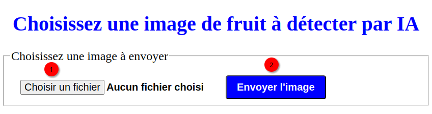
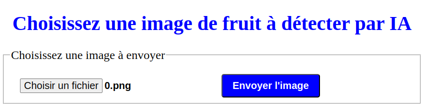
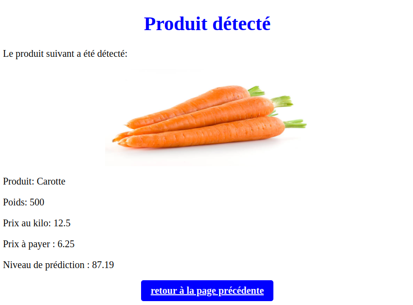
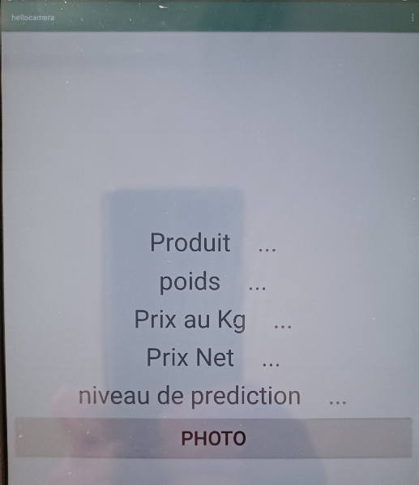
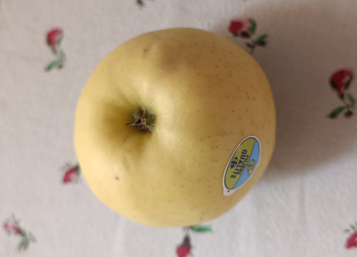
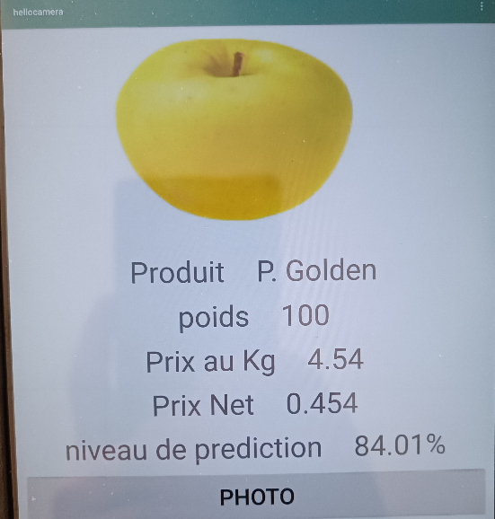

# **Balance intelligente**

**Simulation de la détection automatique de fruits et légumes pour une balance : plus besoin de choisir manuellement le produit !**

  La recherche est décentralisée et peut donc être faite depuis tout type d'appareil sur le réseau : caisse, caisse libre service, téléphone...

---

# **Installation**

L'installation est prévur sur une base Ubuntu/Debian.
Prérequis :
- Un système à jour
- Une version de python
- Les outils ***pip*** , ***pyenv*** et **make** installés et configurés
&nbsp;
&nbsp;

Un makefile automatise les principales étapes :
1. make setup
2. make precommit_install
3. make pip_requirements

Transférer les modèles vers le répertoire ***models***

# **Utilisation**
## **Page Web** :
Page de Sélection :

Prêt à envoyer l'image !

Voici le résultat :

## **Application Android**
Démarrez l'application et prenez une photo :

Voici un produit de test :

Et le résultat :

# **Crédits et contacts**
Antoine Multedo
Martin Ossand
Patrice dufourny
